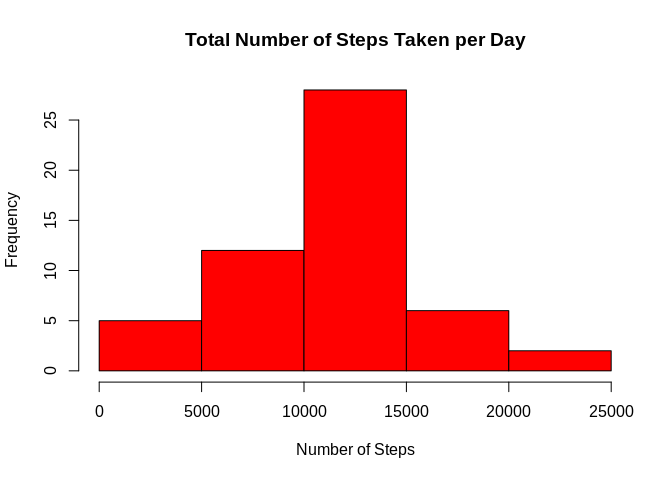
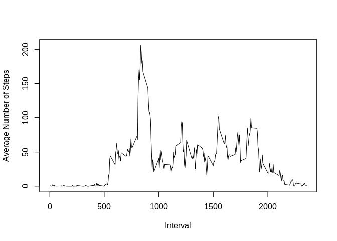
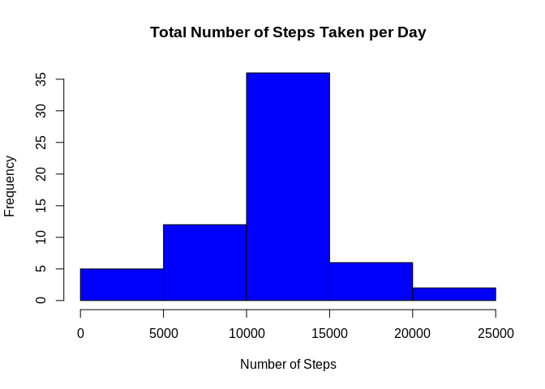
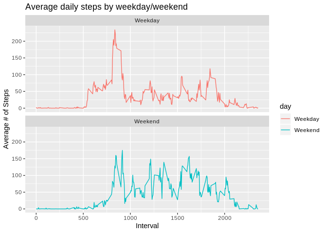

Introduction
------------

It is now possible to collect a large amount of data about personal
movement using activity monitoring devices such as a Fitbit, Nike
Fuelband, or Jawbone Up. These type of devices are part of the
“quantified self” movement – a group of enthusiasts who take
measurements about themselves regularly to improve their health, to find
patterns in their behavior, or because they are tech geeks. But these
data remain under-utilized both because the raw data are hard to obtain
and there is a lack of statistical methods and software for processing
and interpreting the data.

This assignment makes use of data from a personal activity monitoring
device. This device collects data at 5 minute intervals through out the
day. The data consists of two months of data from an anonymous
individual collected during the months of October and November, 2012 and
include the number of steps taken in 5 minute intervals each day.

Step 1: Loading and pre-processing of data
------------------------------------------

    library(ggplot2)
    unzip("activity.zip")
    activity<-read.csv("activity.csv")

Add additional field *day* to display if the day of the week is a
weekend or weekday

    activity$day<-sapply(activity$date, function(x) {
            if(weekdays(as.Date(x)) == "Saturday" | weekdays(as.Date(x)) == "Sunday")
            {y <- "Weekend"} else
            {y <- "Weekday"}
    })

    summary(activity)

    ##      steps                date          interval          day           
    ##  Min.   :  0.00   2012-10-01:  288   Min.   :   0.0   Length:17568      
    ##  1st Qu.:  0.00   2012-10-02:  288   1st Qu.: 588.8   Class :character  
    ##  Median :  0.00   2012-10-03:  288   Median :1177.5   Mode  :character  
    ##  Mean   : 37.38   2012-10-04:  288   Mean   :1177.5                     
    ##  3rd Qu.: 12.00   2012-10-05:  288   3rd Qu.:1766.2                     
    ##  Max.   :806.00   2012-10-06:  288   Max.   :2355.0                     
    ##  NA's   :2304     (Other)   :15840

Step 2: What is the total number of steps taken each day?
---------------------------------------------------------

Sum steps by day using aggregate function and plot results in a
histogram.

    totalSteps<-aggregate(steps ~ date, activity, sum)
    hist(totalSteps$steps, 
         main="Total Number of Steps Taken per Day", 
         xlab="Number of Steps",
         col="red")

Step 3: What are the mean and median number of steps taken each day?
--------------------------------------------------------------------

    meanSteps<-mean(totalSteps$steps)
    meanSteps

    ## [1] 10766.19

    medianSteps<-median(totalSteps$steps)
    medianSteps

    ## [1] 10765

Step 4: Display a time series plot of the average number of steps taken.
------------------------------------------------------------------------

    averageSteps<-aggregate(steps ~ interval, activity, mean)
    plot(averageSteps$steps~averageSteps$interval, 
         ylab="Average Number of Steps",
         xlab="Interval",
         type="l")

Step 5: What is the 5-minute interval that, on average, contains the maximum number of steps?
---------------------------------------------------------------------------------------------

Find the interval where the average number of steps is highest.

    maxSteps<-averageSteps[which.max(averageSteps$steps),]
    maxSteps$interval

    ## [1] 835

Step 6: Code to describe a strategy for imputing missing data.
--------------------------------------------------------------

One of the easiest ways to impute missing values is to fill them in such
a way that statistical measures of the data, such as mean and variance
do not change. In this instance, imputing missing data by using the
average number of steps for the interval should suffice.  
First the number of missing values is determined:

    countNA<-sum(is.na(activity$steps))
    countNA

    ## [1] 2304

Next a new dataframe is created and the missing value is imputed with
the average number of steps for the interval where the missing value is
found:

    imputeSteps<-transform(activity, steps = ifelse(is.na(activity$steps), averageSteps$steps, activity$steps))

To confirm this is successful, we check again for the number of missing
values:

    countNA2<-sum(is.na(imputeSteps$steps))
    countNA2

    ## [1] 0

Step 7: What are the total number of steps taken each day now that the missing values have been imputed?
--------------------------------------------------------------------------------------------------------

    totalSteps_imputed<-aggregate(steps ~ date, imputeSteps, sum)
    hist(totalSteps_imputed$steps, 
         main="Total Number of Steps Taken per Day", 
         xlab="Number of Steps",
         col="blue")

Step 8: Panel plot comparing the average number of steps taken per 5-minute interval across weekdays and weekends.
------------------------------------------------------------------------------------------------------------------

Use ggplot to display a plot of average steps per time interval for each
day type, Weekend and Weekday, as determined by the *day* field created
in Step 1.

    steps_by_day<-aggregate(steps~interval + day, activity, mean, na.rm = TRUE)
    ggplot(steps_by_day, aes(x = interval, y = steps, color = day)) +
            geom_line() +
            labs(title = "Average daily steps by weekday/weekend", x = "Interval", y = "Average # of Steps") +
            facet_wrap(~day, ncol = 1, nrow = 2)

